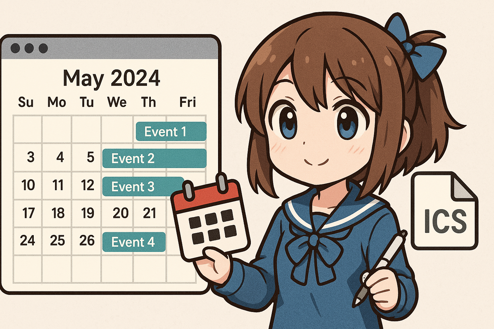

# 🗓️ 米哈游游戏日历订阅

✨ 自动同步《原神》《星穹铁道》《绝区零》的官方活动日程到您的日历应用

## 📥 订阅方法

1. **复制**下方需要的日历链接
2. **打开**您使用的日历应用（支持Google日历、Outlook、苹果日历等）
3. 找到**订阅日历**功能，粘贴URL完成订阅

---

## 🏮 原神日历
| 分类           | 订阅链接                                                                                  |
| -------------- | ----------------------------------------------------------------------------------------- |
| 📌 全部日程     | [点击订阅](https://raw.gitmirror.com/Trrrrw/hoyo_calendar/main/ics/原神.ics)              |
| 🌟 角色祈愿     | [点击订阅](https://raw.gitmirror.com/Trrrrw/hoyo_calendar/main/ics/原神/祈愿.ics)         |
| 🎮 游戏活动     | [点击订阅](https://raw.gitmirror.com/Trrrrw/hoyo_calendar/main/ics/原神/活动.ics)         |
| 📺 前瞻直播     | [点击订阅](https://raw.gitmirror.com/Trrrrw/hoyo_calendar/main/ics/原神/前瞻特别节目.ics) |
| ⏰ 任务限时奖励 | [点击订阅](https://raw.gitmirror.com/Trrrrw/hoyo_calendar/main/ics/原神/任务限时奖励.ics) |
| 🃏 七圣召唤     | [点击订阅](https://raw.gitmirror.com/Trrrrw/hoyo_calendar/main/ics/原神/七圣召唤.ics)     |
| 👗 衣装限时折扣 | [点击订阅](https://raw.gitmirror.com/Trrrrw/hoyo_calendar/main/ics/原神/衣装限时折扣.ics) |
| ⚙️ 版本更新     | [点击订阅](https://raw.gitmirror.com/Trrrrw/hoyo_calendar/main/ics/原神/版本更新.ics)     |

## 🚄 星穹铁道日历
| 分类       | 订阅链接                                                                                  |
| ---------- | ----------------------------------------------------------------------------------------- |
| 📌 全部日程 | [点击订阅](https://raw.gitmirror.com/Trrrrw/hoyo_calendar/main/ics/星铁.ics)              |
| 🌟 光锥跃迁 | [点击订阅](https://raw.gitmirror.com/Trrrrw/hoyo_calendar/main/ics/星铁/活动跃迁.ics)     |
| 🎮 游戏活动 | [点击订阅](https://raw.gitmirror.com/Trrrrw/hoyo_calendar/main/ics/星铁/活动.ics)         |
| 📺 前瞻直播 | [点击订阅](https://raw.gitmirror.com/Trrrrw/hoyo_calendar/main/ics/星铁/前瞻特别节目.ics) |
| ⚙️ 版本更新 | [点击订阅](https://raw.gitmirror.com/Trrrrw/hoyo_calendar/main/ics/星铁/版本更新.ics)     |

## 🎧 绝区零日历
| 分类         | 订阅链接                                                                                    |
| ------------ | ------------------------------------------------------------------------------------------- |
| 📌 全部日程   | [点击订阅](https://raw.gitmirror.com/Trrrrw/hoyo_calendar/main/ics/绝区零.ics)              |
| 🌟 代理人调频 | [点击订阅](https://raw.gitmirror.com/Trrrrw/hoyo_calendar/main/ics/绝区零/调频.ics)         |
| 🎮 游戏活动   | [点击订阅](https://raw.gitmirror.com/Trrrrw/hoyo_calendar/main/ics/绝区零/活动.ics)         |
| 📺 前瞻直播   | [点击订阅](https://raw.gitmirror.com/Trrrrw/hoyo_calendar/main/ics/绝区零/前瞻特别节目.ics) |
| ⚙️ 版本更新   | [点击订阅](https://raw.gitmirror.com/Trrrrw/hoyo_calendar/main/ics/绝区零/版本更新.ics)     |

---

## ⚙️ 高级选项

🔹 **连续日程模式**：在URL的`/ics/`后添加`continuous/`即可订阅带持续时间的完整日程  
> 示例：`https://raw.gitmirror.com/Trrrrw/hoyo_calendar/main/ics/continuous/原神.ics`

---

## 📱 效果预览

  
  

<!-- ---

## ❓ 常见问题

1. xxxxxx
   - xxxxxx -->

---

## 🌟 项目特点
- ✅ 非自动同步官方活动日程
- 🆓 完全免费开源
- 🔄 每日手动更新
- 📅 支持主流日历应用

---

> 📢 本项目为爱好者制作，与米哈游官方无关  
> 🐛 问题反馈：[GitHub Issues](https://github.com/Trrrrw/hoyo_calendar/issues)  
> 🖼️ Banner图片由 [ChatGPT](https://chat.openai.com) 生成